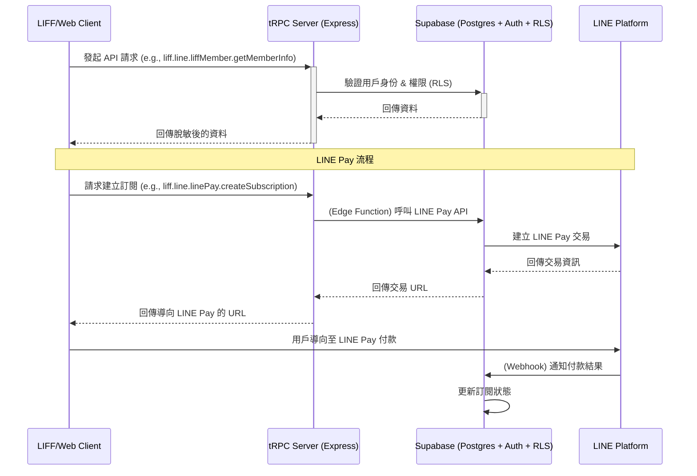

# YaoYouQian 管理雲 Sprint 2-3 開發計畫與架構分析

**版本:** 1.0
**日期:** 2026-02-17
**作者:** Manus AI (資深全端執行者)

---

## 1. 總體目標

本文件旨在闡述「YaoYouQian 管理雲 Sprint 2-3」的全功能對接開發計畫。目標是基於現有的 `sprint-1-architecture-refactor` 分支所建立的架構基礎，完成所有 LIFF 客戶端、員工端、輕量 Web 管理後台以及 LINE Pay 訂閱功能的全功能實作。所有開發將直接在 `main` 分支上進行，並確保最終交付產物符合企業級資安標準與代碼可維護性。

## 2. 現有架構回顧

經過初步分析，系統採用了現代化的技術棧，為後續開發奠定了良好基礎：

- **前端 (Client):** Vite + React + TypeScript + TailwindCSS，搭配 shadcn/ui 元件庫，提供高效的開發體驗與一致的 UI 風格。
- **後端 (Server):** Node.js + Express，並透過 tRPC 實現類型安全的前後端 API 通信。
- **資料庫 (Database):** Supabase (PostgreSQL) 作為唯一的資料來源 (Single Source of Truth)，並使用 Drizzle ORM 進行資料庫操作，確保類型安全。
- **路由 (Routing):** 前端使用 `wouter` 進行頁面導航，後端 API 路由則由 tRPC Router 統一管理。
- **認證 (Authentication):** 整合 LINE LIFF SDK 進行用戶身份驗證，並透過 tRPC 中間件 (middleware) 實現權限控管。

## 3. 核心開發原則與資料流

所有開發將嚴格遵守您設定的「絕對行為準則」。

### 3.1 資安優先 (Security First)

- **前端隔離:** 所有 LIFF 與 Web 頁面嚴禁包含任何 `secret`、`private key` 或直接對 Supabase 資料庫進行寫入操作。所有敏感資訊（如 LINE Pay 金鑰、Supabase Service Role Key）將儲存在 Supabase Vault 中，並僅由後端 Edge Functions 或受保護的 tRPC Router 存取。
- **API 封裝:** 前端僅能呼叫 tRPC API。後端 tRPC Router 將作為唯一的資料閘口，負責處理所有商業邏輯與資料庫互動。Supabase 的 Row Level Security (RLS) 將被啟用並配置，確保即使 API 被意外暴露，資料層級的權限依然有效。

### 3.2 資料流向圖 (Data Flow)

## 4. 預計修改與新增檔案清單

以下為各功能模組的詳細實作計畫，包含預計修改或新增的檔案。

### 4.1 LIFF 客戶端功能

| 路由 | 頁面元件 (Page Component) | 主要 tRPC Router | 涉及資料表 | 實作重點 |
| :--- | :--- | :--- | :--- | :--- |
| `/liff/booking` | `liff/BookingForm.tsx` | `liffBookingRouter` | `services`, `staff`, `appointments`, `bookingSlotLimits` | 實現選服務→選人員→選時段→填寫資料→確認的完整流程。 |
| `/liff/member` | `LiffMemberCenter.tsx` | `liffMemberRouter` | `customers`, `appointments`, `orders` | 會員卡、點數、消費紀錄、預約管理（查詢/取消/修改）、個資編輯。 |
| `/liff/shop` | `liff/Shop.tsx` | `liffShopRouter` | `products`, `orders`, `orderItems` | 商品分類、列表、詳情、購物車、結帳流程（不含金流）。 |
| `/liff/news` | `liff/News.tsx` | `notificationRouter` | `notifications` | 列表與詳情頁，後台發送的通知將顯示於此。 |
| `/liff/consent` | `liff/Consent.tsx` | `consentFormRouter` | `consentForms`, `customerConsents` | 顯示後台設定的同意書內容，使用簽名版元件，提交簽名。 |
| `/liff/gamification` | `liff/Gamification.tsx` | `gamificationRouter` | `gamificationCampaigns`, `prizes`, `plays` | 抽獎動畫、獎品展示、中獎紀錄。 |

### 4.2 LIFF 員工端功能

| 路由 | 頁面元件 (Page Component) | 主要 tRPC Router | 涉及資料表 | 實作重點 |
| :--- | :--- | :--- | :--- | :--- |
| `/liff/staff/clock` | `liff/staff/Clock.tsx` | `clockRouter` | `clockRecords` | GPS 定位打卡、打卡記錄、出勤統計。 |
| `/liff/staff/schedule` | `liff/staff/Schedule.tsx` | `scheduleRouter` | `staffSchedules` | 週/月視圖班表、換班申請。 |
| `/liff/staff/appointments` | `liff/staff/Appointments.tsx` | `appointmentRouter` | `appointments`, `customers` | 時間軸視圖、客戶資訊、服務項目。 |
| `/liff/staff/customers` | `liff/staff/Customers.tsx` | `customerRouter` | `customers`, `tags` | 客戶搜尋、基本資訊、消費紀錄、標籤。 |
| `/liff/staff/performance` | `liff/staff/Performance.tsx` | `revenueRouter` | `commissionRecords` | 本月業績、獎金預估、排名。 |

### 4.3 Web 管理後台功能

將建立以下新的頁面元件，並完善對應的 tRPC Router 邏輯。

| 路由 | 頁面元件 (新增) | 主要 tRPC Router | 涉及資料表 | 實作重點 |
| :--- | :--- | :--- | :--- | :--- |
| `/manage/appointments` | `AppointmentManagement.tsx` | `appointmentRouter` | `appointments` | 日曆/列表視圖、CRUD 操作。 |
| `/manage/customers` | `CustomerManagement.tsx` | `customerRouter` | `customers` | 搜尋、篩選、標籤管理、匯出。 |
| `/manage/staff` | `StaffManagement.tsx` | `staffRouter` | `staff` | 列表、角色管理。 |
| `/manage/schedule` | `ScheduleManagement.tsx` | `scheduleRouter` | `staffSchedules` | 週視圖、拖曳排班。 |
| `/manage/services` | `ServiceManagement.tsx` | `serviceRouter` | `services` | 服務項目 CRUD。 |
| `/manage/products` | `ProductManagement.tsx` | `shopRouter` | `products` | 商品 CRUD、庫存管理。 |
| `/manage/notifications` | `NotificationManagement.tsx` | `notificationRouter` | `notifications` | 推播歷史、排程推播。 |
| `/manage/gamification` | `GamificationManagement.tsx` | `gamificationRouter` | `gamificationCampaigns`, `prizes` | 活動設定、獎品管理、數據統計。 |
| `/manage/reports` | `ReportDashboard.tsx` | `analyticsRouter` | `appointments`, `orders`, `customers` | 營收、預約、客戶分析報表。 |
| `/manage/settings` | `TenantSettings.tsx` | `tenantRouter` | `tenants`, `tenantSettings` | 診所基本資訊、營業時間、LINE 設定。 |

### 4.4 LINE Pay 訂閱整合

1.  **建立 `linePayRouter`:**
    - `createSubscriptionRequest`: 接收前端方案選擇，呼叫 Supabase Edge Function 產生 LINE Pay 付款連結。
    - `getSubscriptionStatus`: 查詢用戶目前的訂閱狀態。
    - `cancelSubscription`: 處理用戶取消訂閱的請求。
2.  **建立 Supabase Edge Functions:**
    - `line-pay-request`: 接收來自 `linePayRouter` 的請求，帶上後端儲存的 LINE Pay Secret，向 LINE Pay API 發起交易請求。
    - `line-pay-confirm-webhook`: 接收 LINE Pay 的付款成功 Webhook，驗證請求來源，並更新 Supabase 中的 `tenantSubscriptions` 資料表。
3.  **前端頁面:**
    - `/subscription/plans`: 顯示 `yyq_basic` / `yyq_advanced` 方案供用戶選擇。
    - `/subscription/manage`: 讓用戶查看目前方案、管理訂閱（如取消）。

## 5. 驗收與交付

- **階段性驗證:** 在完成每個主要功能模組（如 LIFF 客戶端、員工端）後，將進行內部測試。
- **最終驗證:** 所有功能開發完成後，將執行 `pnpm build` 與 `npx tsc --noEmit` 確保專案可成功建置且無類型錯誤。
- **交付產物:**
    1.  所有代碼將直接 `push` 至 `main` 分支。
    2.  產出一份完整的 Sprint 2-3 成果報告 `YAOYOUQIAN_SPRINT23_REPORT.md`。

---

**請審核以上架構與開發計畫。若無異議，我將立即開始編碼實作。**
