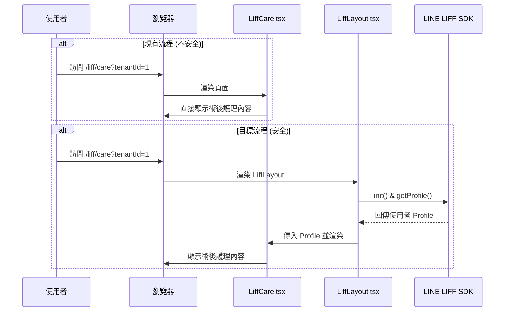

# YaoYouQian 專案驗收問題修復計畫

**文件版本:** 1.0
**日期:** 2026-02-17

## 1. 總體目標

本計畫旨在響應 `YAOYOUQIAN_AUDIT_REPORT.md` 中指出的六項待解決問題。我們將遵循「文檔驅動開發」原則，在獲得您的批准後，分階段實施修復，以提升專案的安全性、前端性能、代碼品質與長期可維護性。

## 2. 架構分析與資料流

本次修復涉及兩個關鍵的認證與授權流程調整，旨在確保敏感資料與操作的安全性。

### 2.1. `LiffCare.tsx` 認證流程

- **目前流程:** 使用者可直接透過 URL (`/liff/care?tenantId=...`) 訪問術後護理資訊，無需經過 LIFF 身份驗證。
- **風險:** 任何知道 `tenantId` 的人都可以存取該診所的所有術後護理內容，造成敏感資訊洩漏。
- **目標流程:** 強制所有對 `/liff/care` 的訪問都必須經過 LIFF 登入。`LiffLayout` 元件將負責處理 LIFF 初始化與使用者 Profile 獲取，未登入者將無法看到任何內容。

### 2.2. `linePayRouter.ts` 權限控制

- **目前流程:** `subscribe` 和 `cancelSubscription` 等敏感操作使用 tRPC 的 `publicProcedure`，允許任何客戶端直接呼叫。
- **風險:** 惡意使用者可未經授權地為任何租戶訂閱或取消方案，可能導致服務中斷或產生非預期的費用。
- **目標流程:** 將相關 procedure 從 `publicProcedure` 更改為 `protectedProcedure`。`protectedProcedure` 中間件會驗證請求中是否包含有效的用戶身份（透過 `ctx.user`），無效請求將被拒絕，從而確保只有已登入且授權的使用者才能執行這些操作。

## 3. 預計修改的檔案清單

下表列出了為完成所有修復任務，預計將會修改的核心檔案。

| 任務分類 | 預計修改檔案 |
| :--- | :--- |
| **1. Code Splitting** | `client/src/App.tsx` |
| **2. `any` 型別修復** | `shared/types.ts`, `shared/shared-types.ts`, `drizzle/schema.ts`, 以及 `client/` 和 `server/` 目錄下約 80+ 個 `.ts`/`.tsx` 檔案 |
| **3. Loading/Error 狀態** | `client/src/pages/**/*.tsx` 中約 30-40 個缺少處理的頁面元件 |
| **4. LIFF 認證** | `client/src/pages/LiffCare.tsx`, `client/src/App.tsx` |
| **5. tRPC 權限** | `server/routers/linePayRouter.ts` |
| **6. 清理 `console.log`** | `client/` 和 `server/` 目錄下約 15-20 個包含 `console.log` 的檔案 |

## 4. 詳細修復方案

### 4.1. [High] 前端 Bundle 過大 (Code Splitting)

- **策略:** 我們將在 `client/src/App.tsx` 中，全面採用 `React.lazy` 和 `Suspense` 進行路由層級的代碼分割。
- **步驟:**
    1. 將所有頁面元件（位於 `client/src/pages/`）的靜態 `import` 改為動態 `import()` 語法，並用 `React.lazy()` 包裹。
    2. 在 `Router` 元件的 `<Switch>` 外層包裹 `<Suspense>` 元件。
    3. 提供一個簡潔的全局加載指示器（例如置中的 Spinner）作為 `Suspense` 的 `fallback`，以改善頁面切換時的用戶體驗。

### 4.2. [High] 大量使用 `any` 型別

- **策略:** 採用由後端到前端、由核心到周邊的策略，逐步替換 `any` 型別。
- **步驟:**
    1. **定義核心型別:** 在 `shared/types.ts` 和 `drizzle/schema.ts` 中，定義或匯出所有資料庫表、API 回應的標準 TypeScript 型別。
    2. **tRPC Routers:** 為 `server/routers/` 下所有 router 的 `input` 和 `output` 添加精確的 Zod schema 或型別定義。
    3. **前端頁面:** 修改 `client/src/pages/` 下的元件，使其 `props`、`state` 以及從 tRPC hooks (`useQuery`, `useMutation`) 接收的 `data` 都使用已定義的型別，而非 `any`。
    4. **元件 Props:** 為 `client/src/components/` 下的共用元件定義明確的 `Props` 介面。

### 4.3. [High] 缺少 Loading/Error 狀態處理

- **策略:** 系統性地檢查所有使用 tRPC hooks 的頁面，並為其補全 `isLoading` 和 `isError` 的 UI 處理邏輯。
- **步驟:**
    1. **識別目標:** 遍歷 `grep -rln "useQuery\|useMutation"` 找出的檔案清單。
    2. **添加 Loading UI:** 當 `isLoading` (或 `isPending` for mutations) 為 `true` 時，顯示骨架屏 (`Skeleton`) 或加載指示器 (`Spinner`)，避免頁面空白。
    3. **添加 Error UI:** 當 `isError` 為 `true` 時，顯示一個友善的錯誤提示元件（例如 ShadCN 的 `Alert`），包含錯誤訊息 (`error.message`) 和一個「重試」按鈕（觸發 `refetch()`）。

### 4.4. [High] `LiffCare.tsx` 頁面無 LIFF 認證

- **策略:** 將 `LiffCare.tsx` 的路由定義從公共路由移至受 `LiffLayout` 保護的路由。
- **步驟:**
    1. **修改 `App.tsx`:**
        - 移除 `<Route path="/liff/care" component={LiffCare} />` 這一行。
        - 新增一個 `LiffPage` 輔助函數，用於包裹需要 LIFF 認證的頁面。
        - 在路由表中新增 `<Route path="/liff/care">{() => <LiffPage component={LiffCare} />}</Route>`。
    2. **修改 `LiffCare.tsx`:** 調整元件，使其能從 `LiffLayout` 傳遞的 `props` 中接收 `profile` 和 `tenantId`。

### 4.5. [Medium] `linePayRouter.ts` 使用 `publicProcedure`

- **策略:** 將 `linePayRouter.ts` 中涉及狀態變更的 mutations 切換為 `protectedProcedure`。
- **步驟:**
    1. **修改 `server/routers/linePayRouter.ts`:**
        - 將 `subscribe` 和 `cancelSubscription` 兩個 mutation 的 `publicProcedure` 替換為 `protectedProcedure`。
        - `protectedProcedure` 會自動利用 `TrpcContext` 中的 `user` 物件進行身份驗證，未登入的請求將直接返回 `UNAUTHORIZED` 錯誤。

### 4.6. [Low] 清理 `console.log`

- **策略:** 全局搜索並移除所有用於開發調試、但不再需要的 `console.log` 語句。
- **步驟:**
    1. 使用 `grep -rn "console\.log"` 找出所有 `console.log` 的位置。
    2. 逐一審查，保留必要的錯誤日誌（`console.error`），移除其餘所有 `console.log`。

## 5. 驗收標準

1. **零編譯錯誤:** 執行 `pnpm exec tsc --noEmit` 指令，必須無任何錯誤輸出。
2. **建置成功:** 執行 `pnpm build` 指令，必須成功完成前端與後端的建置。
3. **Bundle Size 顯著減小:** `dist/public/assets/index-*.js` 的檔案大小應從 ~1.7MB 降低至 1MB 以下。
4. **功能驗證:**
    - `LiffCare` 頁面在未登入 LIFF 時應無法查看內容。
    - `linePayRouter` 的 `subscribe` 端點在未登入時呼叫應返回錯誤。
    - 所有修復的頁面在數據加載時應顯示 Loading 狀態，出錯時應顯示 Error 狀態。
5. **代碼推送:** 所有修改成功合併並推送到 `main` 分支。
6. **產出報告:** 提交最終的修復報告 `YAOYOUQIAN_FIX_REPORT.md`。

請檢閱此計畫。若無異議，請回應「批准 (Approved)」，我將立即開始執行。
