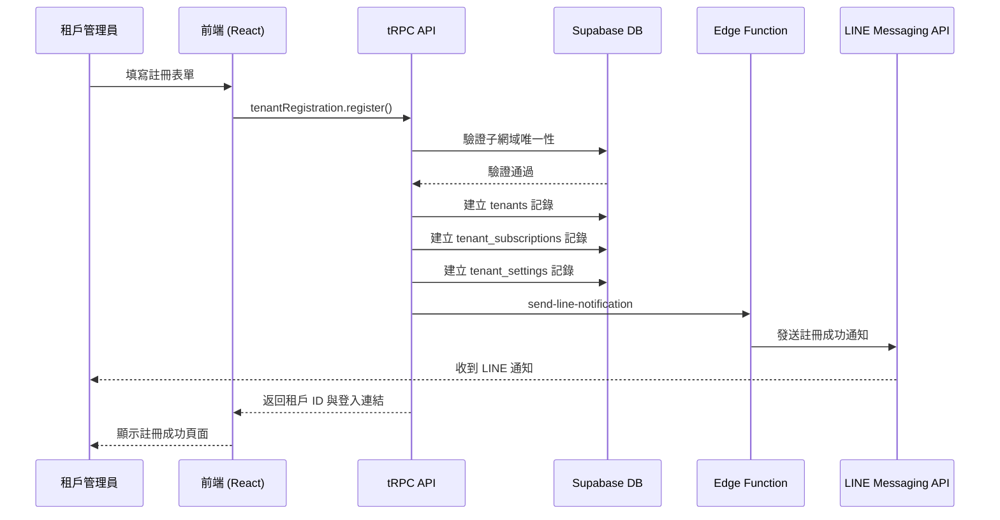
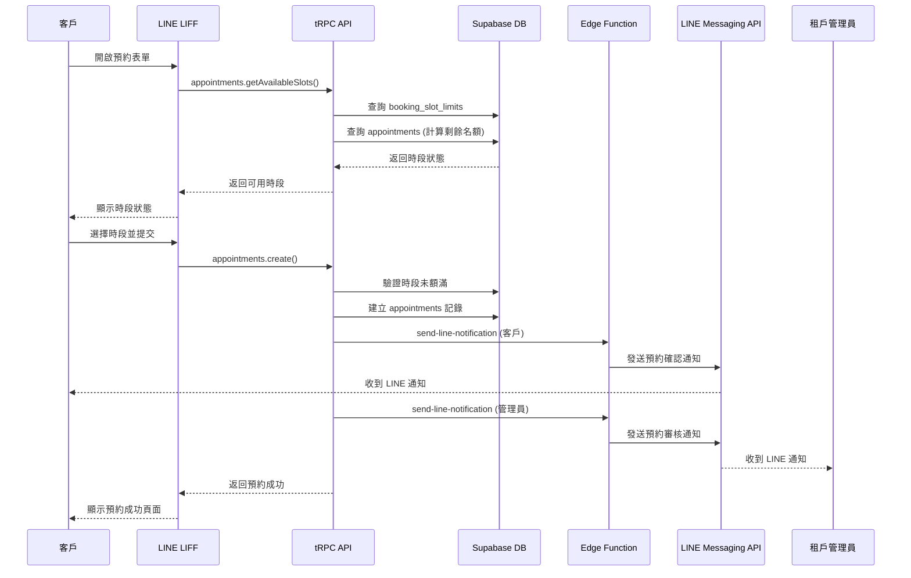
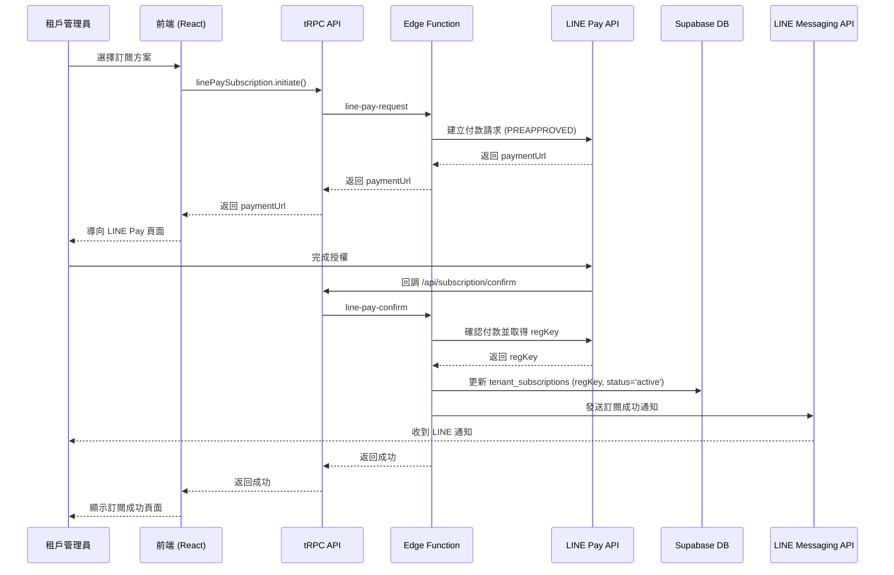
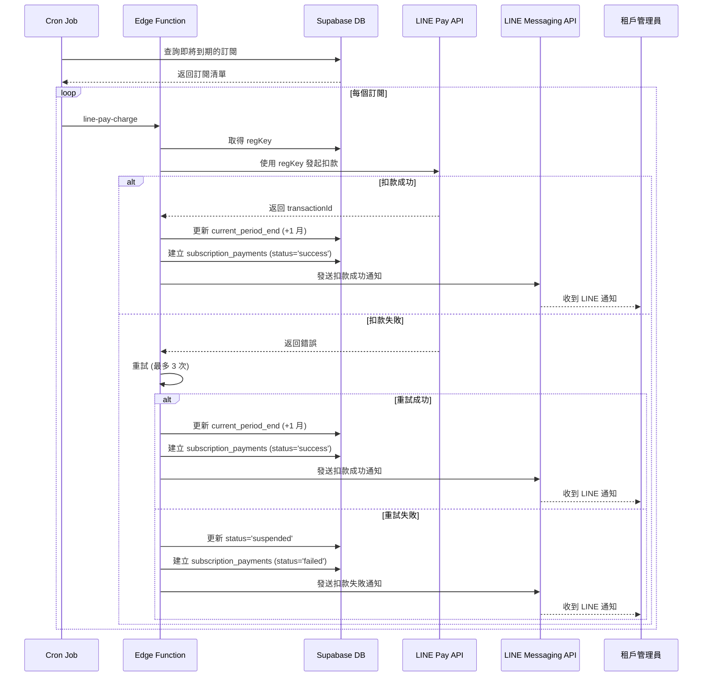
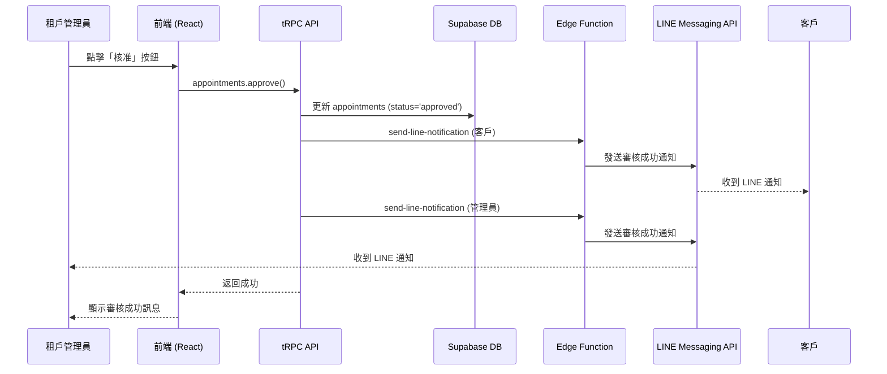
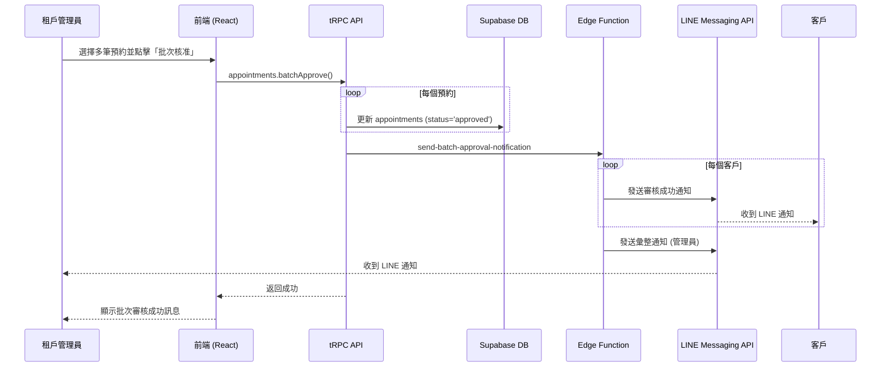
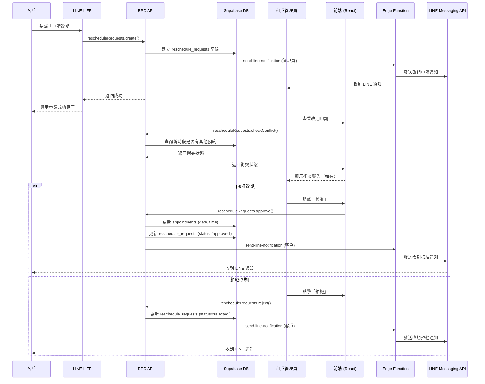
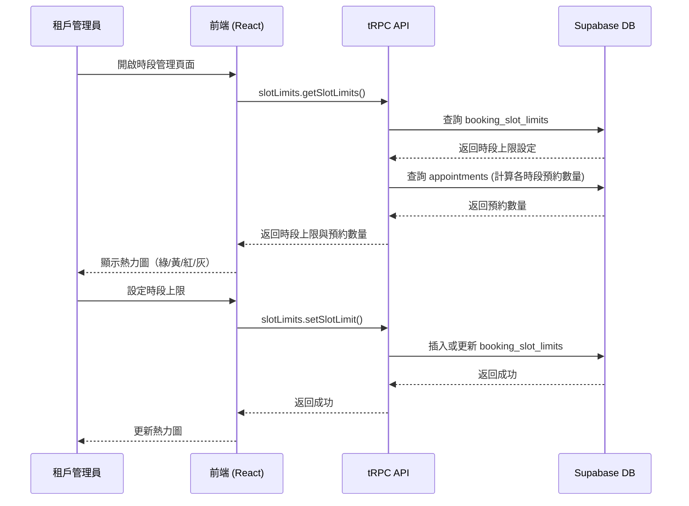
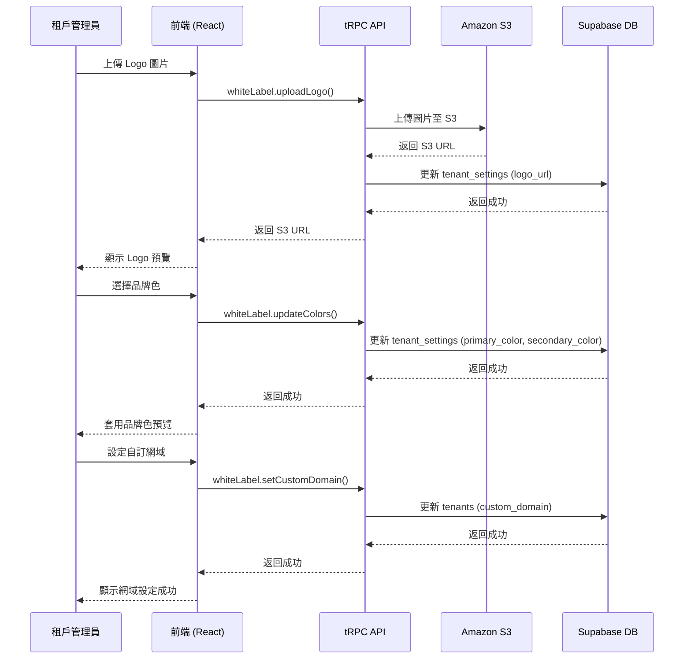
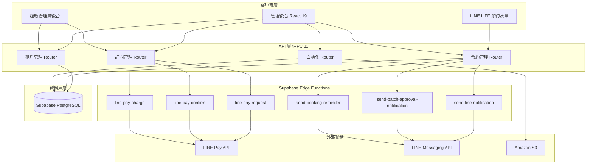

# YoCHiLLSAAS 多租戶預約系統 - 資料流向圖

**作者**: Manus AI  
**日期**: 2026-02-07  
**版本**: 1.0

---

## 一、租戶註冊流程

---

## 二、LINE LIFF 預約流程

---

## 三、LINE Pay 訂閱流程

### 3.1 首次授權流程

### 3.2 定期扣款流程

---

## 四、預約審核流程

### 4.1 單筆審核流程

### 4.2 批次審核流程

---

## 五、預約改期流程

---

## 六、時段管理流程

---

## 七、白標化設定流程

---

## 八、系統架構總覽

---

**文檔結束**
